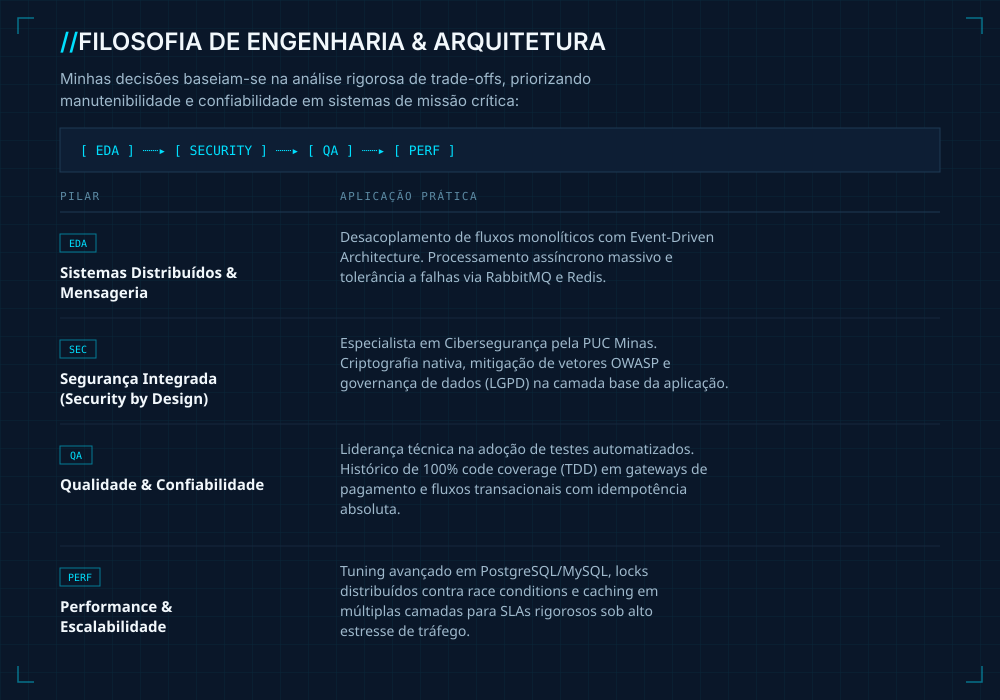

  
  
  
  

---

  

---

### `// STACK CORE & INFRAESTRUTURA`

**Backend & Arquitetura**

**Frontend**

**Dados & Cache**

**Infraestrutura & Cloud**

> **Automação & Scraping:** extração e ingestão de dados em larga escala com **Selenium**, **Laravel Dusk** e integrações de API complexas (**GraphQL/REST**).

---

### `// PROJETOS & ARQUITETURAS EM DESTAQUE`

<table>
<tr>
<td width="50%" valign="top">

`PROJ · 01`
### Smart Resume
**Serverless & Edge Computing**

Portfólio interativo sob filosofia Zero-Dependency (Vanilla JS/CSS) para 100/100 no Core Web Vitals. Frontend distribuído via Edge CDN (Vercel/GitHub Pages) e pipeline de telemetria assíncrona ingerindo métricas em tempo real em PostgreSQL gerenciado (Supabase), operando serverless.

[🔗 Ver projeto](https://andreodevv.github.io/portfolio/)

</td>
<td width="50%" valign="top">

`PROJ · 02`
### Bar.Ganha
**E-commerce & Economia Circular**

Plataforma em C# / ASP.NET MVC com separação rigorosa de camadas (BLL e DAL), garantindo integridade transacional via SQL Server e pronta para escala vertical/horizontal no Azure. Resultou em nota máxima e convite formal para incubação pela PUC Minas.

</td>
</tr>
<tr>
<td width="50%" valign="top">

`PROJ · 03`
### CalorieCounter
**Motor Biofísico & Clean Architecture**

Full Stack (Laravel/Vue.js) para cálculos de variáveis biofísicas e ajustes preditivos de macronutrientes. Clean Architecture estrita isolando regras de domínio via Service e Repository Patterns, com alta testabilidade e desacoplamento total da persistência (PostgreSQL).

</td>
<td width="50%" valign="top">

`PROJ · 04`
### FinImprover
**Pipeline ETL & BI Financeiro**

Motor preditivo de orçamento com pipeline ETL para importação, sanitização e categorização de bases financeiras legadas. Interface de análise otimizada para I/O de baixa latência com Laravel Livewire + MySQL, projetando cenários de fluxo de caixa em dashboards em tempo real.

</td>
</tr>
</table>

---

### `// GITHUB ANALYTICS`

---

### `// CONTATO & DISCUSSÕES TÉCNICAS`

Disponível para discutir desafios arquiteturais de alta complexidade, modernização de sistemas legados ou mentoria técnica em ambientes de alto desempenho.

